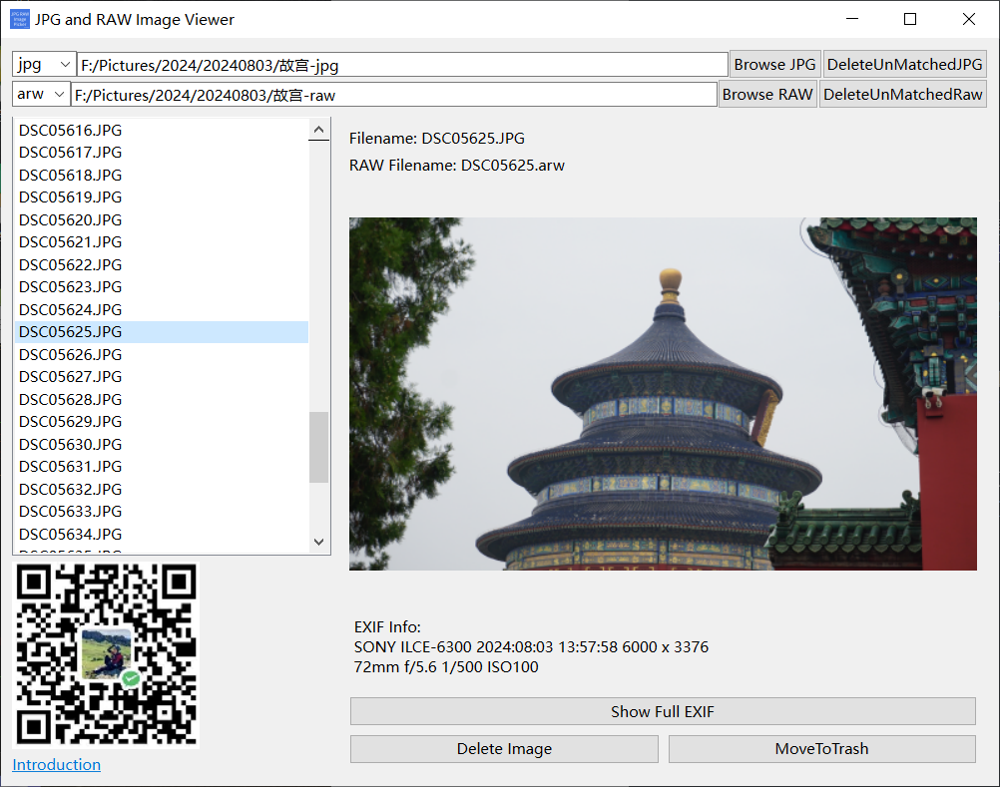

# JPG_RAW_imagePicker
很多摄影师会同时拍摄raw+jpg两种格式的图片，筛选废片时一般用jpg进行预览，删除jpg时希望也能同时删除对应的raw文件。  
另外，对于双内存卡的摄影师，可能存在删除了jpg，但对应的raw没有删除，或者删除了raw，但对应的jpg没有删除。  
此软件的基本功能就是完成这些事情的。

## 使用方法
1. 设置jpg、raw文件对应的文件后缀，不同相机可能对应不同的后缀。若内置没有，可先手动输入，按Enter键确认，欢迎可留言，后期更新时加上。
2. 设置jpg、raw文件所在的目录，可通过浏览按钮选择对应目录，也可手动输入，按Enter键确认。
3. 右上角【DeleteUnmatchedJPG】 若jpg图片没有对应的raw文件，则删jpg图片。此按钮会检查jpg文件夹下的所有jpg。
3. 右上角【DeleteUnmatchedRaw】 若raw文件没有对应的jpg图片，则删raw文件。此按钮会检查raw文件夹下的所有raw。
4. 下方【DELETE Image】 按钮删除当前选中的照片。 删除的照片会先保存在jpg目录下的 deleted_images 文件夹，以避免误删。快捷键【Backspace-即回退键】
5. 下方【MoveToTrash】将deleted_imges文件夹删除至电脑垃圾桶，保持jpg目录干净并再次避免误删。

## 界面小提示
1. 照片上方会显示对应的jpg和raw文件的文件名，若没有找到对应的raw文件，会红色显示。
2. 照片下方会显示主要的EXIF信息

## 赞助
若软件帮助到了您，且您愿意支持作者的开发及维护工作，您可随心赞助。
